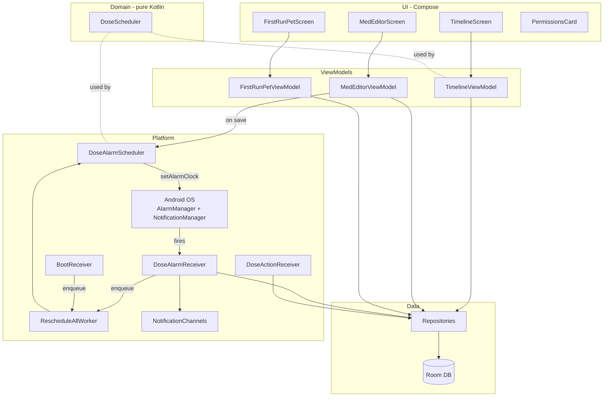

# Pet Meds (Android, MVP)

Offline-first, zero-backend medication tracker for pets. Native Android,
Kotlin + Jetpack Compose. This repository contains the MVP slice agreed in
the project plan (`/.cursor/plans/pet_meds_mvp_android_*.plan.md`):

- One pet (the data model is multi-pet ready from day one).
- Add/edit medications with decimal dosage, form, daily-times schedule,
  optional interval-hours or PRN, course start/end dates, and notes.
- Local notifications via `AlarmManager.setAlarmClock` with `Mark taken`
  and `Skip` actions.
- Daily chronological timeline (home screen).
- Boot, package-replace, and timezone-change resilient via `WorkManager`.
- Permissions UX for `POST_NOTIFICATIONS`, exact alarms, and
  battery-optimisation exemption.

The OCR scanner, biometric/PIN lock, photo journal, PDF "Vet Report"
export, and freemium IAP are intentionally deferred. The architecture
leaves room for them - see [Roadmap](#roadmap).

## Important caveat: there is no backup yet

The PRD's "zero-backend" promise has a sharp edge: if the user loses
or wipes their phone, the entire pet medical history goes with it. The
MVP does not yet ship a backup mechanism. Before any real release, add
a user-initiated JSON + photos export to the Storage Access Framework
(Google Drive, Files, etc.). Tracked in the roadmap below.

## Stack

- Kotlin 2.0.21, Jetpack Compose Material 3 (Compose BoM 2024.12.01)
- minSdk 26 (Android 8.0), targetSdk 35 (Android 15)
- Room 2.6.1 with KSP
- Hilt 2.52 with `hilt-work` for `WorkManager` integration
- AlarmManager exact alarms, `RECEIVE_BOOT_COMPLETED` BootReceiver
- kotlinx-datetime, kotlinx-serialization
- DataStore Preferences (reserved)
- AndroidX Biometric (reserved for v1.1)

## Build

You need Android Studio Ladybug (or newer) with Android SDK 35 installed.

```bash
# Generate the Gradle wrapper (one-time, needs gradle 8.9+ available locally)
gradle wrapper --gradle-version 8.9

# Run unit tests
./gradlew :app:testDebugUnitTest

# Install a debug build on a connected device
./gradlew :app:installDebug
```

If you do not have a local Gradle, open the project in Android Studio
which will download the wrapper for you.

## Architecture



## Data model

Stored in `petmeds.db` (Room), all in app-private storage:

- `pets` (id, name, species, photoPath?, createdAt)
- `medications` (id, petId FK, name, dosageAmount, dosageUnit, form,
  scheduleJson, startDate, endDate?, notes?, isActive, createdAt)
- `dose_logs` (id, medicationId FK, scheduledAt?, takenAt?, status,
  createdAt) - append-only, soft-delete via `medications.isActive = 0`
- `scheduled_alarms` (id, medicationId FK, requestCode, firesAt) -
  bookkeeping for `PendingIntent` cancellation

`scheduleJson` is a kotlinx-serialization sealed class - new schedule
variants (specific weekdays, complex tapering, etc.) can be added
without a Room schema migration.

## Reminder reliability

This is the riskiest part of any pet-meds app. The strategy:

1. On medication save, `DoseAlarmScheduler.rescheduleFor(medId)`
   computes the next `HORIZON_DAYS` of doses with `DoseScheduler` and
   schedules each via `AlarmManager.setAlarmClock` (highest reliability,
   exempt from Doze).
2. `DoseAlarmReceiver` fires, inserts a `PENDING` `dose_log`, posts the
   notification, and enqueues `RescheduleAllWorker` to top up the
   horizon.
3. `BootReceiver` listens for `BOOT_COMPLETED`, `MY_PACKAGE_REPLACED`,
   `TIMEZONE_CHANGED`, and `LOCALE_CHANGED`; each enqueues
   `RescheduleAllWorker` which wipes and rebuilds alarms from active
   medications.
4. The first launch surfaces a `PermissionsCard` that walks the user
   through `POST_NOTIFICATIONS`, `SCHEDULE_EXACT_ALARM`, and
   `REQUEST_IGNORE_BATTERY_OPTIMIZATIONS`. We fall back to
   `setAndAllowWhileIdle` (inexact) if exact alarms are denied.
5. Notifications use `VISIBILITY_PRIVATE` with a generic public version
   ("Medication reminder") so the lock screen does not leak the pet
   or medication name.

The MVP does not yet detect missed-dose patterns and surface an OEM
battery-opt explainer for Xiaomi/Oppo/Vivo. See the roadmap.

## Module / package layout

```
app/
  build.gradle.kts
  src/main/
    AndroidManifest.xml
    java/com/example/petmeds/
      PetMedsApplication.kt
      MainActivity.kt
      AppNavViewModel.kt
      di/                # Hilt modules
      data/
        db/              # AppDatabase, entities, DAOs, type converters
        repo/            # Pet/Medication/DoseLog repositories
      domain/
        model/           # Pet, Medication, DoseLog, ScheduleConfig
        schedule/        # DoseScheduler (pure Kotlin, unit-tested)
      notifications/
        DoseAlarmScheduler.kt
        DoseAlarmReceiver.kt
        DoseActionReceiver.kt
        DoseNotificationFactory.kt
        BootReceiver.kt
        RescheduleAllWorker.kt
        NotificationChannels.kt
        AlarmIntents.kt
      ui/
        theme/           # Color, Type, Theme
        timeline/        # TimelineScreen + ViewModel
        meds/            # MedEditorScreen + ViewModel + dialogs
        pets/            # FirstRunPetScreen + ViewModel
        permissions/     # PermissionsCard + state
        common/          # PetAvatar, formatters
    res/values/strings.xml, themes.xml, colors.xml
  src/test/.../DoseSchedulerTest.kt
  src/androidTest/.../AppDatabaseTest.kt
```

## Permissions declared

- `POST_NOTIFICATIONS` (runtime, API 33+)
- `SCHEDULE_EXACT_ALARM` + `USE_EXACT_ALARM` (medical-app justification
  for Play review)
- `RECEIVE_BOOT_COMPLETED`
- `WAKE_LOCK`
- `REQUEST_IGNORE_BATTERY_OPTIMIZATIONS`
- `VIBRATE`

Reserved for deferred features (not in current manifest):
`CAMERA` (OCR), `USE_BIOMETRIC`.

## Tests

- Unit: `DoseSchedulerTest` covers daily-times, PRN, inactive,
  end-date inclusion, interval-hours fixed-clock semantics, specific
  weekdays, month rollover, and DST spring-forward.
- Instrumented: `AppDatabaseTest` exercises the Room schema with an
  in-memory database.

## Smoke test

See [SMOKE_TEST.md](SMOKE_TEST.md) for the device checklist - alarm
fires when app is killed, reboot recovery within 30 s of unlock,
timezone reschedule, mark-taken round-trip, edit reschedule, and
OEM battery-killer regression.

## Accessibility

See [A11Y_NOTES.md](A11Y_NOTES.md) for the audit. Summary: WCAG AA
contrast, 48 dp tap targets, TalkBack labels on every interactive
element, dynamic type up to 200%.

## Roadmap

In priority order:

1. **JSON + photos export to SAF** (P0). Closes the data-loss gap
   created by the zero-backend promise.
2. **PIN + biometric lock** (P0 for sensitive health data). PIN
   hashed with PBKDF2/Argon2id, key derived in Android Keystore;
   `androidx.biometric` for fingerprint/face. Free tier - we do not
   recommend hiding security primitives behind a paywall.
3. **OCR prescription scanner** (P1). CameraX + ML Kit bundled
   text-recognition + a single-screen review form that pre-populates
   the med editor.
4. **SQLCipher database encryption** (P1). Pair with biometric.
5. **Photo journaling and PDF Vet Report export** (P2). Per the PRD's
   "vet report" workflow.
6. **Multi-pet UI** (P2). The relational model is ready; only the UI
   needs the pet picker and per-pet timeline filter.
7. **OEM-specific battery-killer detection** (P2). Xiaomi/Oppo/Vivo
   need separate auto-start manager guidance.
8. **Pro tier IAP** (P3). One-time purchase for multi-pet UI + PDF
   export. Recommend NOT moving biometric or JSON export behind a
   paywall.

## Issues with the original PRD

The full list is in the plan file. Key ones we either fixed in MVP or
explicitly defer with a documented mitigation:

- Reminder reliability under-specified (FIXED via exact alarms +
  BootReceiver + battery-opt UX).
- Reboot/TZ behaviour undefined (FIXED).
- Course start/end dates missing (FIXED, end date inclusive).
- Soft-delete semantics for medications (FIXED).
- "Every 8h" ambiguity (RESOLVED to fixed clock slots).
- Backup story missing (DEFERRED, called out as P0 for next sprint).
- DB encryption (DEFERRED to v1.1 alongside biometric).
- Lock-screen privacy on notifications (FIXED).
- Freemium hiding biometric (RECOMMENDATION: don't).

## License

TBD.
