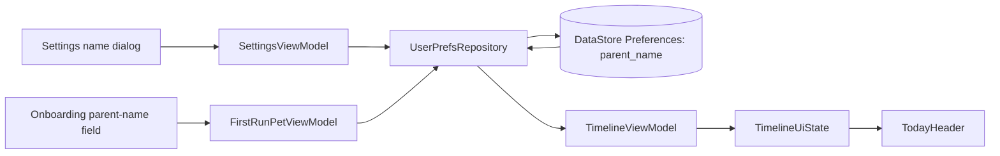

# Parent-Centric Today Screen Implementation

## Purpose

This document records the implementation completed for the parent-centric Today screen work. The goal was to reframe the app home screen around the pet parent instead of making it feel like a single-pet profile page.

The change keeps the current MVP assumption that onboarding creates one pet, but changes the information architecture and copy so the Today screen can later support multiple pets without needing a major header redesign.

## Product Decisions Implemented

- The home screen is now addressed to the pet parent, not the pet.
- The greeting is intentionally small and secondary.
- The dose summary is now the visual lead of the Today screen.
- The pet avatar was removed from the Today header because it made the screen feel like it belonged to one pet.
- Pet-specific identity remains available on dose cards through existing `TimelineItem` fields.
- Parent name is optional.
- If a parent name exists, the header says `Good afternoon, Sarah`.
- If no parent name exists, the header falls back to `Good afternoon`.
- The parent name can be entered during onboarding.
- The parent name can be edited later from Settings.
- Parent name persistence uses DataStore Preferences, not Room.

## User-Facing Behavior

### Today Header Before Parent Name Is Set

The Today screen renders a small greeting/date line:

```text
Good afternoon  .  Sunday, 3 May
```

Below that, the main headline is the medication summary:

```text
1 dose left today
```

If there are scheduled doses today, the progress bar appears below the headline:

```text
0 of 1 done
```

### Today Header After Parent Name Is Set

After the parent name is saved as `Sarah`, the Today header renders:

```text
Good afternoon, Sarah  .  Sunday, 3 May
1 dose left today
0 of 1 done
```

The implementation uses the existing time-of-day logic:

- `Good morning` before 12:00
- `Good afternoon` from 12:00 through 17:59
- `Good evening` from 18:00 onward

### Summary Headline Rules

The Today headline is computed from timeline state:

- No medications or timeline content: `No medications yet`
- No scheduled doses today: `No doses scheduled today`
- All today's doses are complete: `All caught up`
- One remaining dose: `1 dose left today`
- Multiple remaining doses: `<n> doses left today`

The "remaining" count is:

```text
overdue + dueNow + upNext
```

Tomorrow's doses are shown in the timeline but do not count as doses left today.

## Data Flow



In plain terms:

1. Onboarding and Settings both write the parent name through `UserPrefsRepository`.
2. `UserPrefsRepository` stores the value in DataStore Preferences using the `parent_name` key.
3. `TimelineViewModel` observes `UserPrefsRepository.observeParentName()`.
4. The observed value is added to `TimelineUiState.parentName`.
5. `TimelineScreen` passes `state.parentName` into `TodayHeader`.
6. `TodayHeader` renders the parent-aware greeting.

## Files Added

### `app/src/main/java/com/example/petmeds/data/prefs/UserPrefsRepository.kt`

This file introduces a small persistence abstraction for user-level preferences.

Public API:

```kotlin
interface UserPrefsRepository {
    fun observeParentName(): Flow<String?>
    suspend fun setParentName(name: String?)
}
```

Implementation details:

- Uses `DataStore<Preferences>`.
- Stores the parent name under `stringPreferencesKey("parent_name")`.
- Emits `null` when no name is stored.
- Emits `null` when the stored value is blank.
- Trims values before storing.
- Removes the key entirely when the incoming name is null or blank.

Important behavior:

```kotlin
val trimmed = name?.trim()
if (trimmed.isNullOrBlank()) prefs.remove(KEY_PARENT_NAME)
else prefs[KEY_PARENT_NAME] = trimmed
```

This prevents whitespace-only names from being treated as real parent names.

### `app/src/main/java/com/example/petmeds/di/PrefsModule.kt`

This file wires DataStore and the prefs repository into Hilt.

It provides:

- A singleton `DataStore<Preferences>`
- A binding from `UserPrefsRepositoryImpl` to `UserPrefsRepository`

DataStore file name:

```kotlin
private const val PREFS_FILE = "user_prefs"
```

DataStore creation:

```kotlin
PreferenceDataStoreFactory.create(
    produceFile = { context.preferencesDataStoreFile(PREFS_FILE) },
)
```

The module uses `@ApplicationContext`, so the DataStore is app-scoped and safe to inject into ViewModels.

### `app/src/main/java/com/example/petmeds/ui/settings/SettingsViewModel.kt`

This file introduces a Hilt ViewModel for Settings.

Responsibilities:

- Observe the current parent name.
- Write updated parent-name values back to `UserPrefsRepository`.

Public state:

```kotlin
val parentName: StateFlow<String?>
```

Write API:

```kotlin
fun updateParentName(value: String?)
```

The flow uses:

```kotlin
SharingStarted.WhileSubscribed(5_000)
```

This matches the existing app pattern used by timeline state and avoids keeping collection active when the Settings screen is not visible.

## Files Modified

### `app/src/main/java/com/example/petmeds/ui/timeline/TimelineModels.kt`

`TimelineUiState` now carries the parent name:

```kotlin
val parentName: String? = null
```

This keeps the UI layer simple. `TimelineScreen` no longer needs to know where the parent name comes from; it just renders state.

The pet fields remain:

```kotlin
val petName: String = ""
val petPhotoPath: String? = null
```

Those are still useful for single-pet display and for future places where pet identity is needed. The change only removes pet identity from the Today header.

### `app/src/main/java/com/example/petmeds/ui/timeline/TimelineViewModel.kt`

`TimelineViewModel` now injects:

```kotlin
private val userPrefsRepository: UserPrefsRepository
```

The parent-name flow is included in the existing timeline state combine:

```kotlin
combine(
    petRepository.observeAll(),
    medicationRepository.observeActive(),
    doseLogRepository.observeWindow(...),
    tickFlow,
    userPrefsRepository.observeParentName(),
) { pets, meds, logs, now, parentName ->
    buildState(pets, meds, logs, now, parentName)
}
```

`buildState(...)` now accepts:

```kotlin
parentName: String?
```

When there is no pet yet, the state still includes the parent name:

```kotlin
TimelineUiState(
    loading = false,
    hasPet = false,
    parentName = parentName,
)
```

When there is a pet, the state includes:

```kotlin
parentName = parentName
```

This means parent-name state is independent from pet existence.

### `app/src/main/java/com/example/petmeds/ui/timeline/TimelineScreen.kt`

The Today header call site changed from pet-centric:

```kotlin
TodayHeader(
    petName = state.petName,
    petPhotoPath = state.petPhotoPath,
    todayDone = state.todayDone,
    todayTotal = state.todayTotal,
)
```

To parent-centric:

```kotlin
TodayHeader(
    parentName = state.parentName,
    summary = summaryHeadline(state),
    todayDone = state.todayDone,
    todayTotal = state.todayTotal,
)
```

The `TodayHeader` composable now accepts:

```kotlin
private fun TodayHeader(
    parentName: String?,
    summary: String,
    todayDone: Int,
    todayTotal: Int,
)
```

The header now renders in this order:

1. Small greeting and date line.
2. Large bold medication summary.
3. Progress bar and completion label, only when `todayTotal > 0`.

The pet avatar is no longer rendered in the header. This removes the visual implication that the entire home screen belongs to a single pet.

The progress label changed from:

```text
0/1
```

To:

```text
0 of 1 done
```

This is clearer and more parent-readable.

New helper:

```kotlin
private fun summaryHeadline(state: TimelineUiState): String
```

It owns the summary-headline copy rules so the composable stays focused on layout.

### `app/src/main/java/com/example/petmeds/ui/pets/FirstRunPetViewModel.kt`

`FirstRunUiState` now includes:

```kotlin
val parentName: String = ""
```

The ViewModel now injects:

```kotlin
private val userPrefsRepository: UserPrefsRepository
```

New setter:

```kotlin
fun onParentNameChanged(value: String)
```

Submit behavior now saves both the pet and optional parent name:

```kotlin
petRepository.create(current.name.trim(), current.species)
userPrefsRepository.setParentName(current.parentName.trim().takeIf { it.isNotBlank() })
```

The pet name is still required. The parent name is optional.

### `app/src/main/java/com/example/petmeds/ui/onboarding/OnboardingPager.kt`

The third onboarding page now receives and updates parent name:

```kotlin
parentName = state.parentName
onParentNameChanged = viewModel::onParentNameChanged
```

`OnboardingPage3` now accepts:

```kotlin
parentName: String
onParentNameChanged: (String) -> Unit
```

A new optional text field was added above the pet-name field:

```kotlin
OutlinedTextField(
    value = parentName,
    onValueChange = onParentNameChanged,
    label = { Text("Your name (optional)") },
    placeholder = { Text("e.g. Sarah") },
    singleLine = true,
)
```

The existing pet-name field remains below it and still performs required-name validation.

### `app/src/main/java/com/example/petmeds/ui/settings/SettingsScreen.kt`

`SettingsScreen` now receives a Hilt ViewModel:

```kotlin
viewModel: SettingsViewModel = hiltViewModel()
```

It collects:

```kotlin
val parentName by viewModel.parentName.collectAsStateWithLifecycle()
```

It adds a new `Profile` section above `Notification reliability`.

The Profile section contains one editable row:

- Leading person icon
- Title: `Your name`
- Subtitle: current parent name, or `Add your name`
- Trailing chevron

Tapping the row opens `EditParentNameDialog`.

Dialog behavior:

- Title: `Your name`
- One `OutlinedTextField`
- Placeholder: `e.g. Sarah`
- Buttons: `Cancel` and `Save`
- Save trims the value
- Blank values clear the saved parent name

Save path:

```kotlin
viewModel.updateParentName(value.trim().takeIf { it.isNotBlank() })
```

## Implementation Notes

### Why DataStore Was Used

Parent name is user preference data, not domain data about pets, medications, or dose logs. DataStore Preferences is a good fit because:

- It avoids changing Room schema.
- It avoids migrations.
- It keeps user-level profile settings separate from pet medical data.
- It already fits Android's recommended async preference model.

### Why Parent Name Is Nullable in Shared State

`String?` represents the actual persistence contract:

- `null` means no saved parent name.
- Non-null means show the name.

The UI does not need a separate boolean flag.

### Why Blank Names Are Removed

Blank or whitespace-only values should behave the same as no name. Removing the key keeps persisted data clean and avoids awkward output like:

```text
Good afternoon,
```

### Why TimelineViewModel Owns the Parent Name for Today

The Today screen already renders from `TimelineUiState`. Adding `parentName` there means the composable stays declarative and avoids directly injecting preferences into UI code.

This also keeps future multi-pet behavior easier: Today can eventually receive a parent-level dashboard state while dose cards remain pet-specific.

### Why Pet Avatar Was Removed Only From Header

The plan specifically called out that the header should no longer be pet-owned. Dose cards can still show pet-specific identity later because `TimelineItem` still carries:

- `petId`
- `petName`
- `petPhotoPath`

That preserves future multi-pet affordances without showing a single pet as the owner of the whole page.

## Verification Performed

### Build

The debug APK was built successfully with:

```bash
./gradlew :app:assembleDebug -q
```

The command required full permissions in the Cursor environment because Gradle daemon startup needed host network-interface access.

### Install

The debug APK was installed on the running emulator:

```bash
adb install -r app/build/outputs/apk/debug/app-debug.apk
```

Result:

```text
Success
```

### Today Screen Visual Check

The app was launched on the emulator and the Today screen was inspected.

Observed without parent name:

```text
Good afternoon  .  Sunday, 3 May
1 dose left today
0 of 1 done
```

Observed behavior:

- No pet avatar in the Today header.
- Dose summary is visually dominant.
- Existing dose sections still render below the header.
- Bottom navigation remains intact.

### Settings Profile Check

Settings was opened from the Pet tab.

Observed:

- `Profile` section appears above `Notification reliability`.
- Row title is `Your name`.
- Empty state subtitle is `Add your name`.
- Tapping the row opens a dialog.
- Dialog contains a single name field and `Cancel` / `Save` actions.

### End-to-End Parent Name Check

The value `Sarah` was entered in Settings and saved.

After returning to Today, the header updated to:

```text
Good afternoon, Sarah  .  Sunday, 3 May
1 dose left today
```

This verified:

- Settings writes through `SettingsViewModel`.
- `UserPrefsRepository` persists the value.
- `TimelineViewModel` observes the change.
- `TimelineUiState.parentName` updates.
- `TodayHeader` renders the saved parent name.

## Known Implementation Detail

The original plan mentioned adding string resources such as `parent_name_label`, `parent_name_placeholder`, and home summary strings in `strings.xml`.

The implemented code currently uses inline strings in Compose files for these labels and summaries. Functionally, the requested behavior is implemented and verified. If localization or stricter resource extraction becomes a priority, these inline strings should be moved to `app/src/main/res/values/strings.xml` in a follow-up cleanup.

## Out of Scope Not Implemented

The following items were intentionally not added because they were listed as out of scope:

- Multi-pet onboarding
- Pet switcher
- Multi-pet dashboard grouping
- Data model renames from pet owner to pet parent
- Lottie or haptic changes beyond existing behavior

## Final State

The app now has a parent-centric Today screen supported by a simple user preference flow:

- Onboarding can collect the parent name.
- Settings can edit the parent name.
- DataStore persists the parent name.
- Today observes and displays the parent name.
- The Today header now leads with medication summary rather than pet identity.

